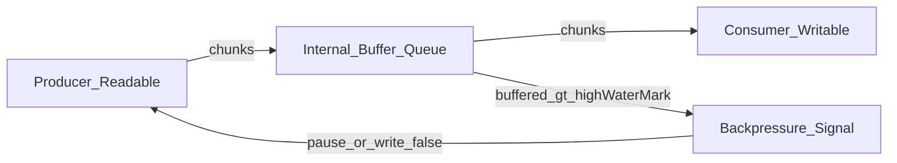

# Streams : Explained

### The problem that streams solve

---

## Prerequisites

Before studying Streams, it's recommended to understand:

- **[Asynchronous Programming](../docs/fundamentals/async-programming.md)**: Event loop, callbacks, microtasks/macrotasks, event-driven patterns
- **[File Systems](../docs/fundamentals/file-systems.md)**: File descriptors, kernel/user-space boundaries, blocking vs non-blocking I/O
- **[Memory](../docs/fundamentals/memory.md)**: Buffering, GC pressure, memory pools, backpressure as a memory safety tool
- **[Binary Data](../docs/fundamentals/binary-data.md)**: Bytes vs text, encodings, “chunks” as byte sequences
- **[Streams (Fundamentals)](../docs/fundamentals/streams.md)**: Core vocabulary and mental models for flow control

See [Fundamentals](../docs/fundamentals/) for the complete list.

---

## Problem Statement

Real systems have 3 recurring realities:

1. **Producers and consumers run at different speeds** (see [Asynchronous Programming](../docs/fundamentals/async-programming.md)).
   - Disk can read faster than your CPU parsing logic.
   - Network can burst data faster than your app can persist it.
   - Your code can generate data faster than the OS can flush it to a socket/disk.

2. **Data is often “too large to fit comfortably”** in memory (see [Memory](../docs/fundamentals/memory.md)).
   - Reading a whole file into RAM is a common beginner move… and a common production incident.
   - Buffers are finite; “just buffer it” turns into latency spikes and out-of-memory crashes.

3. **I/O happens in chunks, not as a perfect continuous stream** (see [File Systems](../docs/fundamentals/file-systems.md)).
   - OS and devices deliver/accept data in chunked transfers.
   - Text encodings and binary formats turn “chunk boundaries” into correctness concerns (see [Binary Data](../docs/fundamentals/binary-data.md)).

If you only have “read all / write all” primitives, you tend to pick one of two bad options:

- **Option A: buffer everything** → memory blowups, GC pressure, unpredictable latency.
- **Option B: block while writing/reading** → poor throughput, low concurrency (see [Asynchronous Programming](../docs/fundamentals/async-programming.md)).

---

## Solution Explanation

### What are Streams?

Streams are a **flow-control abstraction** that let you move data **incrementally** (in chunks) while coordinating speed differences using **backpressure**.

In Node.js, streams are primarily:

- **Readable**: produces chunks
- **Writable**: consumes chunks
- **Duplex**: both readable and writable
- **Transform**: duplex where output is computed from input (e.g., compression, parsing)

Most core streams use **Buffer chunks** (see [Buffers](../buffers/) and [Binary Data](../docs/fundamentals/binary-data.md)), though streams can also be in **objectMode** (where a “chunk” is a JS object).

### The key idea: backpressure

**Backpressure** is the mechanism that prevents a fast producer from overwhelming a slow consumer by signaling “slow down” when internal buffers exceed a threshold.

That threshold is commonly controlled via **`highWaterMark`**.

#### Why `highWaterMark` is not a “limit”

`highWaterMark` is a **signal threshold**, not a hard cap:

- It’s used to decide when reads should pause / when `.write()` should start returning `false`.
- Internal buffering can still exceed it (temporarily), especially when chunks are larger than the remaining space.
- Treat it as: “when buffer reaches ~this size, apply backpressure.”

### A simple flow model

The job of streams is to make that coordination **predictable** and **composable** (e.g., file → transform → network).

---

## Anatomy of buffering in Node streams (conceptual)

### Writable side (most relevant to `writeMany.js`)

When you call `writable.write(chunk)`:

- Node may write immediately to the underlying resource (fd, socket), or
- queue it in the writable’s internal buffer.

If the buffer is “too full”, `.write()` returns `false` to tell you:

> “Stop writing for now; wait for the `'drain'` event before continuing.”

This is **not optional in production**. Ignoring it is a common cause of memory bloat.

### Readable side

Readable streams can be in:

- **paused mode**: data is pulled via `.read()` or piping
- **flowing mode**: `'data'` events push chunks to you

Backpressure propagates upstream (especially when you use `pipe()` / `pipeline()`).

---

## Code Reference (seed)

See [`writeMany.js`](writeMany.js) for a deliberately “naive” stress test that:

- prints `writableHighWaterMark`
- writes many small buffers into a write stream
- shows `writableLength` (bytes queued in memory)

Important note: it does **not** currently handle `'drain'` and it does **not** check the return value of `stream.write()`. That’s intentional for learning (to visualize queue growth), but it’s the opposite of what you want in production.

---

## Production-level safety notes

- **Memory safety**: buffering is memory usage (see [Memory](../docs/fundamentals/memory.md)). Unbounded writes can OOM the process.
- **Correctness**: chunk boundaries are not message boundaries. If you parse text/binary protocols, you must handle split frames (see [Binary Data](../docs/fundamentals/binary-data.md)).
- **Error propagation**: prefer `pipeline()` so errors and teardown propagate through the chain cleanly (deep dive in [Streams guide](../docs/streams.md)).

---

## Cross-References

- **[Buffers](../buffers/)**: Buffers are the default chunk type for most byte streams
- **[EventEmitter](../emitters/)**: Streams emit events (`data`, `end`, `finish`, `error`, `close`)
- **[File System](../file-system/)**: File streams sit on file descriptors and kernel buffering
- **[Streams (Fundamentals)](../docs/fundamentals/streams.md)**: Vocabulary + minimal mental models
- **[Streams (Deep Dive)](../docs/streams.md)**: End-to-end architecture and production patterns (without adding `streams/` examples yet)

---

## Roadmap (WIP)

This concept folder is intentionally **README-only for now**. Future additions will include:

- `app.js`: progressive examples (Readable/Writable/Transform; `pipeline()`; parsing boundaries)
- `production-example.js`: production patterns (AbortSignal, limits, metrics, error propagation)
